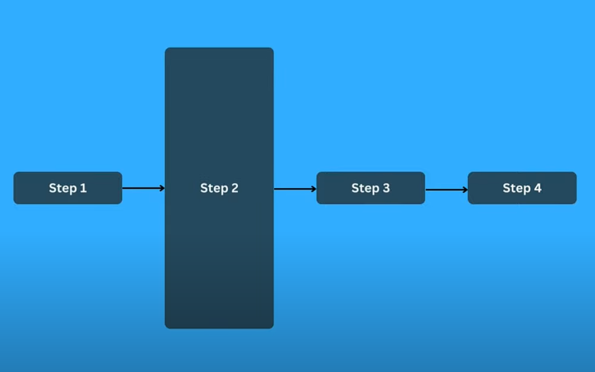
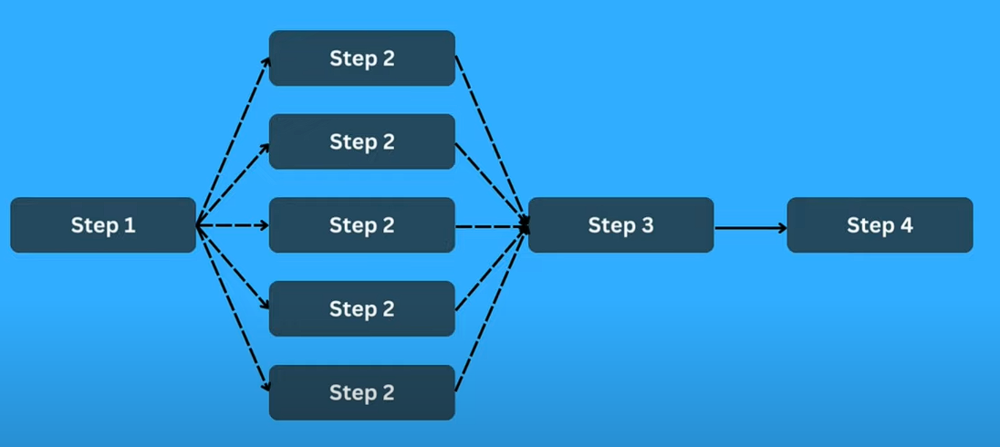
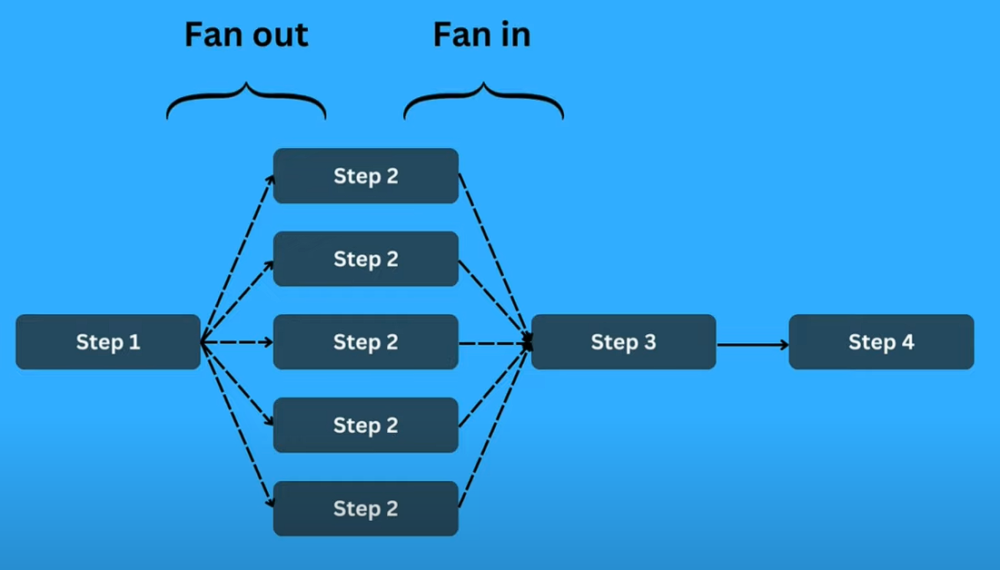

# Тестовый проект с использованием паттерна "Fan-out Fan-in"

## Описание
Этот шаблон используется для достижения параллелизма в тех случаях, когда одну крупную задачу можно разделить на более мелкие и выполнять их параллельно.

## Запуск
Запуск версии ДО (Before):
```bash
cd before
```
```bash
go run .
```

Запуск версии ПОСЛЕ (After):
```bash
cd after
```
```bash
go run .
```

## Назначение

Например, у нас есть процесс обработки из 4-х этапов. Второй этап занимает много времени и тормозит весь процесс:


Если есть возможность разбить второй этап на параллельные задачи, то схема будет такой:


Процесс разбиения на более мелкие называется "Fan-out", а соединения воедино - "Fan-In":



